# IEEE 754

- 十进制: 人类易于理解的数字表现形式
- 二进制: 机器易于理解的形式
- IEEE754: 一种标准,约定了浮点数在内存中如何表示. 由于精度有限, 超过有效数字的实数并不能被 IEEE754 精确表示.

比如十进制小数 0.1 , 通过"乘2取整"的方法转化为二进制小数:
```
0.1 * 2 = 0.2(0)
0.2 * 2 = 0.4(0)
0.4 * 2 = 0.8(0)
0.8 * 2 = 1.6(1)
0.6 * 2 = 1.2(1)
0.2 * 2 = 0.4(0)
0.4 * 2 = 0.8(0)
0.8 * 2 = 1.6(1)
0.6 * 2 = 1.2(1)
...
```

结果为 0.000110011001100...

无论用什么标准, 即使用完整个计算机的内存, 也无法完整地表示这个数. 最多只能取一个近似值.

## IEEE754 标准

我们知道, 任何一个二进制浮点数可以表示为:


1. (-1)^s 表示符号位，当s=0，V为正数；当s=1，V为负数。
2. M表示有效数字，大于等于1，小于2。
3. 2^E 表示指数位。

所以二进制小数 0.000110011001100... 表现为上述公式的形式, 那就是 s = 0, M = 1.100110011001100..., E = -4

那么在内存中应该怎么表示上述的表达式呢? IEEE 754是这么规定的:

对于64位的浮点数，最高的1位是符号位 `sign`，接着是11位的 `exponent`，剩下的52位为 `significand`。

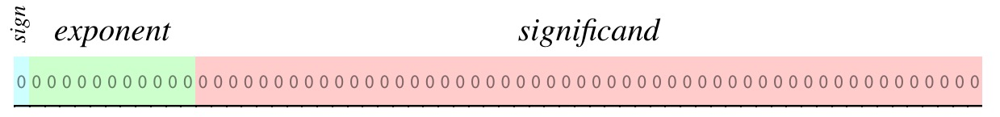

**请注意, 公式里的 M,E 和 上图的 exponent, significand 不是简单的相等关系**


问题来了, 对于十进制0.1来说, 它的 E 是 -4, 怎么表现负指数呢? 又在11位指数位中划出一位做符号位?

IEEE754标准没有划分符号位, 而是把 exponent 全部规整为正数, 采用的方法是加上一个中间数. 对于 32 位浮点数来说, 他的指数部分有8位, 它的中间数采用 2^7 - 1 = 127; 对于 64 位浮点数, 中间数为 2^10 - 1 = 1023;

所以负指数-4 被规整为 -4 + 1023 = 1019 = 1111111011(二进制), 即 `exponent = E + 1023`

前面说过，`1≤M<2`，也就是说，M可以写成1.xxxxxx的形式，其中xxxxxx表示小数部分。IEEE 754规定，在计算机内部保存M时，默认这个数的第一位总是1，因此可以被舍去，只保存后面的xxxxxx部分。比如保存1.01的时候，只保存01，等到读取的时候，再把第一位的1加上去。这样做的目的，是节省1位有效数字。以64位浮点数为例，留给M只有52位，将第一位的1舍去以后，等于可以保存53位有效数字。

即 `significand = (M - 1) * 2^52`

所以对于二进制 1.100110011001100 来说, significand = 100110011001100...

所以, 十进制 0.1 采用 IEEE754 标准, 在内存中表示为:

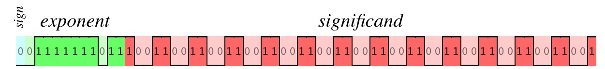

因为 significand 只有52 bit, 超出有效位的数据为 100 1100 (1100...). 根据就近舍入的原则,这里应该进位, 最终十进制0.1在内存中表示为:

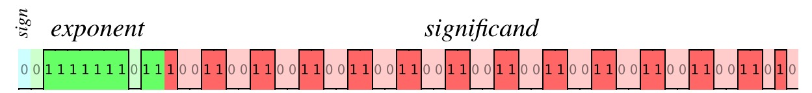

这个[网站](http://bartaz.github.io/ieee754-visualization/)([源码](https://github.com/bartaz/ieee754-visualization))可以对数字进行 IEEE754 内存表示的可视化.


## 无法规整时怎么办

对于64位的浮点数, exponent 的有效位数是11位, 最大只能表示2047, 最小只能表示0.

### 如果指数加上 1023 大于等于 2047

比如要把 2^1024 用 IEEE754 来表示. 这时候 exponent 的11位全部填满了1, IEEE754规定, 在这种情况下, 把有效位数全部清零, 告诉读取这个数的程序, 这个数为 Infinity. 所以, 所有指数部分等于大于1024的数, 在内存中都被表示为:

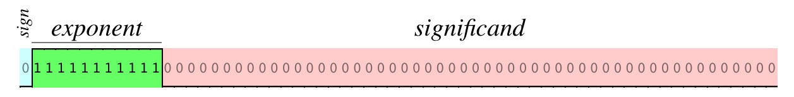

同时还规定, 如果某个用 IEEE754 表示的数, exponent 全为1, significand 部分不全为0, 那么这个数表示 NaN.

所以, IEEE754 能表示的最大的数, 并不是:


而是:

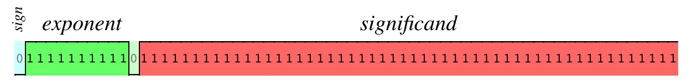

也就是 JavaScript 中的 Number.MAX_VALUE: 1.7976931348623157e+308

这个数的二进制, 是53个1后跟着971个0, 只有让1后面的那个0变成1, 这个数才变成 Infinity. 也就是:

`Number.MAX_VALUE + Math.pow(2, 970) === Infinity`

### 如果指数加上1023小于等于0

比如要把 2^(-1023) 用 IEEE754 来表示, 这时候 exponent 部分全部为0, 这个数已经很小很小了. IEEE754 对于指数小于等于-1023的数, 会将他们的 exponent 全部清零. 程序如果读到 exponent 为0的 IEEE754 浮点数, 会知道这个数已经很小了, 所以将他们的 significand 视为 0.xxxx 而不再是 1.xxxx. 也就是说, 在这种情况下: `M = significand`

所以, IEEE754 能表示的最靠近0的浮点数是:

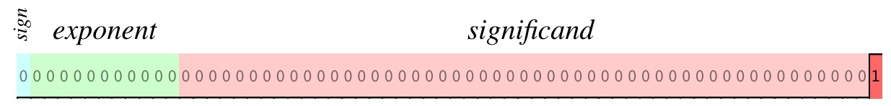

JavaScript 中也就是 Number.MIN_VALUE : 5e−324

## 深入理解

### 哪些数才能被精确表示

整数部分, [MIN_SAFE_VALUE, MAX_SAFE_VALUE]之类的数都可以被精确表示.

小数的话, 因为 significand 表示的是 b51 * 2^(-1) + b50 * 2^(-2) + bi * 2^(i-52) + b0 * 2^(-52), 也就是 0.5, 0.25, 0.125....等1的一半, 1的一半的一半, 1的一半的一半的一半, 一直到 1/2^(52) 的数相加而成.

因此如果一个小数能通过以上一个或多个的数相加而来, 那它就可以被 IEEE754 精确表示.

个人不确定的结论: 是不是这个小数用分数表示, 如果分母只包含因子2, 那么就能被 IEEE754 表示?

### 浮点数最多有17个有效数字

有效数字指科学计算中用以表示一个浮点数精度的那些数字。一般地，指一个用小数形式表示的浮点数中，从第一个非零的数字算起的所有数字。如1.24和0.00124的有效数字都有3位。

虽然 js 高级程序设计 说"浮点数值的最高精度是17位小数", 但从 IEEE754 的原理上看, 它的有效数字其实很多, 截取到17位我觉得是 js 引擎的选择.

比如 IEEE754 表示出的这个数:

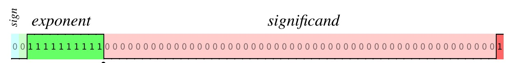

它表示实数集的 1 + 2^(-52) , 也就是 1.0000000000000002220446049250313, 他的有效数字不止17. 只是 js 截取了17的有效数字

``` javascript
> Math.pow(2, -52) + 1
1.0000000000000002
> 1 + 2.220446049250313e-16
1.0000000000000002
```

### MAX_SAFE_VALUE/MIN_SAFE_VALUE

由于 significand 只有 52 比特, 加上隐含的前导1. 一共有 53 bit 的有效数字, 刚好把这么多位整数都用完的最小整数(意味着小数点正好在最后一个1后面, 也就确定了指数的值: 52), 这个数为 2^53 - 1 = 9007199254740991 = Number.MAX_SAFE_VALUE, 而 Number.MIN_SAFE_VALUE 为 -Number.MAX_SAFE_VALUE.

在[Number.MIN_SAFE_VALUE, Number.MAX_SAFE_VALUE] 区间内, IEEE754 标准所表示的整数和数学上的实数一一对应的关系. 在这个区间之外, 一个 IEEE754 整数, 可能对应着两个或若干个实数.  
为什么?  
因为这个数 +1, 在这个指数下, 已经无法表示了. 只能指数+1. 在指数为 53 的情况下, 小数点已经跑到最后一个1的的后面再多一位的位置上了.
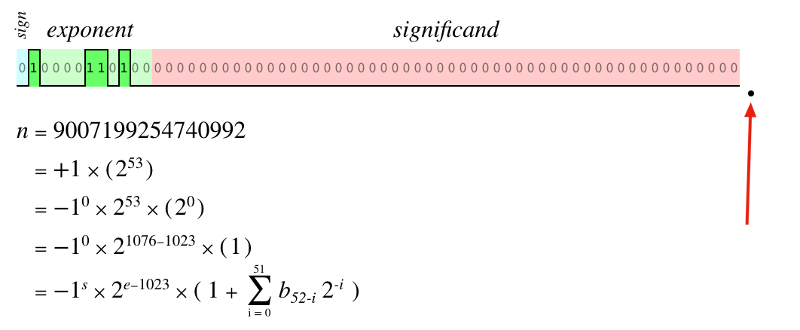

在这个位置, MAX_SAFE_VALUE + 2已经无法被精确表示.

``` javascript
> Number.MIN_SAFE_INTEGER
-9007199254740991
> Number.MAX_SAFE_INTEGER + 1
9007199254740992
> Number.MAX_SAFE_INTEGER + 2
9007199254740992
> Number.MAX_SAFE_INTEGER + 3
9007199254740994
> Number.MAX_SAFE_INTEGER + 4
9007199254740996
> Number.MAX_SAFE_INTEGER + 5
9007199254740996
```

### 为什么 0.1 + 0.2 !== 0.3; 100.1 + 100.2 === 200.3

本质上都是因为浮点数的有效数字最多只有 53 bit. 而很多数都无法精确表示, 因此产生了截断舍入等操作, 从而丢失了精度.

0.1 根据 IEEE754 表示为 1.1001 1001 (1001...) 1010 X 2^(-4)

0.2 根据 IEEE754 表示为 1.1001 1001 (1001...) 1010 X 2^(-3)

根据IEEE754的加法, 将0.1的 M 右移进行对阶: 0.1100 1100 (1100...) 1101 [0] X 2^(-3),
其中方括号中的0为超出 52 bit 的多余位数字, js 采用的是就近舍入, 因此0舍掉.

最终加法为:

```
 0.1100 1100 (1100...) 1101 X 2^(-3) +
 1.1001 1001 (1001...) 1010 X 2^(-3)
 =
10.0110 0110 (0110...) 0111 X 2^(-3)
 =
 1.0011 0011 (0011...) 0011 [1] X 2^(-2)
```

多余位是1, 正好是最低有效位的一半, 根据就近舍入, 若最低有效位现为0,则截尾；若最低有效位现为1,则向上进一位. 这也称为向偶数舍入. 因此结果为:

1.0011 0011 (0011...) 0100 X 2^(-2)

也就是:

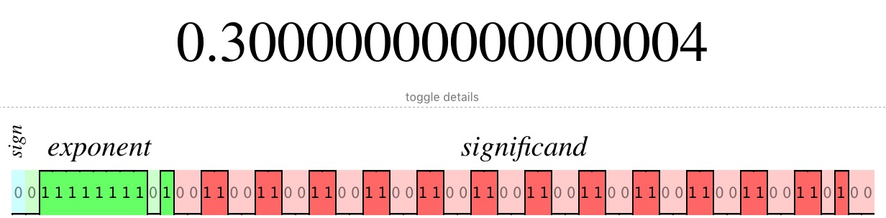

而0.3则是:

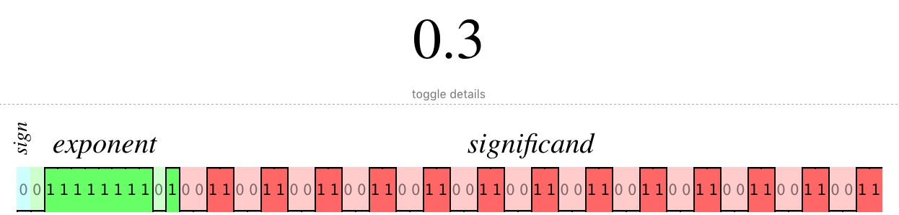

因此对于 IEEE754 标准来说: 0.1 + 0.2 !== 0.3


同理:

100.1 = 1.1001 0000 0110 0110 (0110) 0110 X 2^6

100.2 = 1.1001 0000 1100 1100 (1100) 1101 X 2^6

```
 1.1001 0000 0110 0110 (0110) 0110 X 2^6

+1.1001 0000 1100 1100 (1100) 1101 X 2^6
=
11.0010 0001 0011 0011 (0011) 0011 X 2^6
=
 1.1001 0000 1001 1001 (1001) 1001[1] X 2^7
=
 1.1001 0000 1001 1001 (1001) 1010 X 2^7

也就是十进制的200.3
```

其实本质上和`1.4 + 2.8 === 4.2`一样, 假设每个数都四舍五入, 那么他们看起来就像做了实数运算一样, 但是实际上他们执行的运算只是 `1 + 3 === 4` 罢了.

### 如何舍入

以下这个数 C , 方框中的1000表示有效位之外的数, 请问这个数该如何舍入?
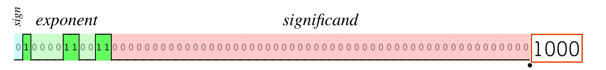

IEEE754 提及了4种舍入规则:

1. 就近舍入
2. 向正无穷方向舍入
3. 向负无穷方向舍入
4. 向0方向舍入

其中就近舍入是默认的舍入方式, 这种会将一个实数向它最接近的能被 IEEE754 表示出来的数舍入. 假设有实数 x, 假设它不能被 IEEE754 准确表示, A 和 B 是两个能被 IEEE754 准确表示且最接近 x 的两个数, 且 `A < x < B`, 用 C 表示 A 和
B 的中点, 那么在实数数轴上 C 到 A 的距离等于 C 到 B 的距离.

如果 x 小于 C, 那么 x 舍入为 A;  
如果 x 大于 C, 那么 x 舍入为 B;  
特殊情况是 x 等于 C, 这种情况下采用向偶数舍入(Ties To Even), A 是偶数的话就舍入到 A, B 是偶数的话就舍入到 B.

对于例子中的 C 来说, 这个是 A:
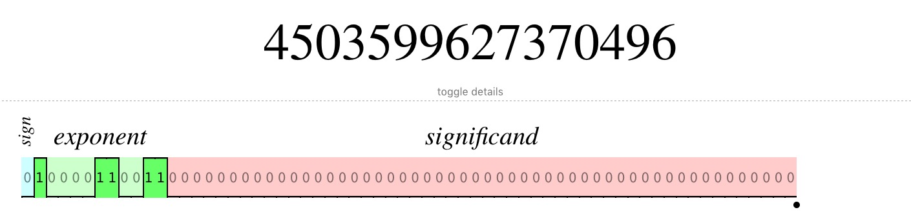

它的二进制表示为 100000...000 (1后面52个0)

比它大的,且能被 IEEE754 表示的, 最小的数 B 为:
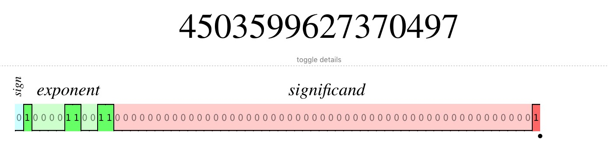

它的二进制表示为 100000...001 (1后面51个0)

按照上述的规则, 因为 A 是偶数, 所以 C 舍入到了 A. 我们在 js 下验证:

```javascript
console.log(4503599627370496.5)
=> 4503599627370496
```

是不是和你的直觉有所差异?

那么怎么知道某两个数的中点是什么? 先从最熟悉的十进制开始, x 和 y 的中点是 (y - x)/2.

对于一个不能用 IEEE754  准确表达的浮点数 x 来说, 在有效位之外的数, 如果第一位为1, 其余数为0, 那么 x 就是某两个能用 IEEE754 准确表达的数的中点.

### 什么是 Infinity

根据 IEEE 754标准的 4.3.1 节:

an infinitely precise result with magnitude at least  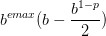 shall round to ∞ with no change in sign.

其中, 对于这里的双精度浮点数来说:

b = 2
emax = 1023
p = 53

算下来:
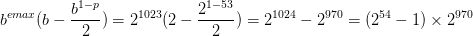

看似很复杂, 但是如果 significand 有53 bit 的话, 这个数可以表示为:

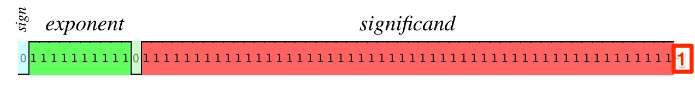

只有等于大于这个数, 才会被表示为 Infinity.

这个数比 Number.MAX_VALUE大多少呢?

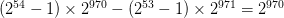

也就说, 要让 Number.MAX_VALUE 变成 Infinity , 至少要加上 2^970

因为 IEEE754 能表示的精度有限, 事实上有无数个 2^970 附近的数被表示成了 2^970, 所以以上的结论更准确地说, 应该是:

要让 Number.MAX_VALUE 变成 Infinity , 至少要加上一个被 IEEE754四舍五入为 2^970 的数.

### 负指数以补码的形式存在?

扯淡. 比如十进制0.5, 转化为2进制的科学计数法, 是: 1.0 * 2^(-1)

-1的补码是 1111 1111 111

而 -1 规整为 exponent, 是 0111 1111 110

两者根本就不等
