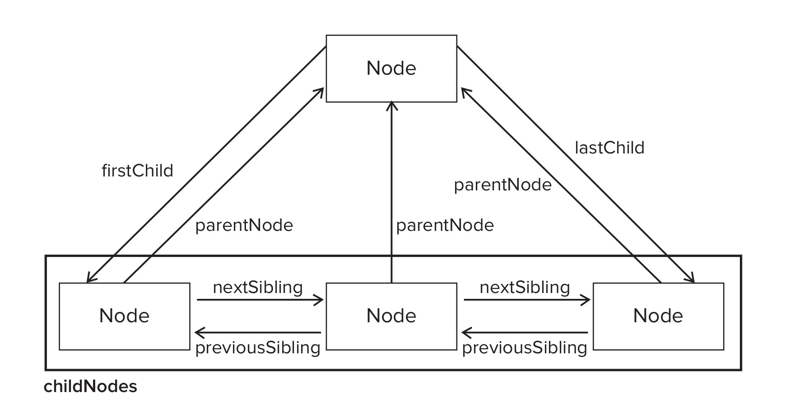

# BOM && DOM

## BOM

BOM(浏览器对象模型) 提供了很多对象, 用来访问浏览器的功能. 常用的对象有 window, location, screen 和 history.

- window

    - window的属性可以被删除, 而全局对象不行
    - setTimout 指定的函数并非一定会在经过多少时间后马上执行. js 是一个单线程解释器, 因此一定时间内只能执行一段代码, 为了控制要执行的代码, 就有一个任务队列. setTimout 只是告诉 js, 经过多长时间把指定代码添加到队列中.
    - alert() / confirm() / prompt()

- location

    - location.hash
    - .host
    - .hostname
    - .pathname

    利用 js 进行页面跳转一般用两种方法: `window.location.replace(url)` 或者 `window.location.href = url`. replace 不在 history 对象中保存原始页面, 可以用来模仿 http 跳转. href 属性可以用来模仿点击链接.

- navigator对象: 用于识别客户端浏览器

- screen
- history

## 客户端检测

**IE Bugs**: DOM 对象是宿主对象, IE9之前的版本中宿主对象时通过 COM 实现的. 因此 `typeof document.createElement` 返回的是 object, 而其他浏览器都是返回 function.

鉴于这个 bug 的存在, 检测某个函数是否可用时, 以下的函数并不靠谱:

```javascript
function hasCreateElement() {
    return typeof document.createElement == "function"
}
```

同时 IE 中的 ActiveX 的行为和其他对象差异很大, 比如直接测试某个属性是否可用时会导致错误:

```javascript
var xhr = new ActiveXObject("Microsoft.XMLHttp")
if (xhr.open) { // 这个测试会发生错误
    // do something
}
```

但是用 `typeof xhr.open` 不会发生错误, 但也不是返回 function, 而是 unknown. 所以稳妥的检测方法是:

```javascript
function isHostMethod(object, property) {
    var t = typeof object[property]
    return t == "function" ||
            (!!(t == "object" && object[property])) ||
            t == "unknown"
}}
```

## DOM

### DOM 节点

DOM 有12种节点类型,  但是有几种类型已经不再推荐使用.DOM 的节点类型都继承自一个基类型: Node.

**IE Bugs**: 一般而言, 通过比较Node.nodeType 常量来确定节点类型.  但是 IE 只能通过比较数值来确定.

每个节点都有 childNodes 属性, 其中保存着 NodeList 对象, NodeList 是一个类似数组的对象, 但是它并不是 Array 的实例, 而是基于 DOM 结构动态执行查询的结果. 可以用数组的 slice 方法将 NodeList 转化为数组: `var arrayOfNodes = Array.prototype.slice.call(someNode.childNodes, 0)`

由于 IE9 之前的 IE 将 NodeList 实现为一个 COM 对象.因此以上的代码对它们来说并不管用, 只能手动循环转化.

节点之间的关系有丰富的 API 来访问:



除此之外, 还有好用的方法:

- hasChildNodes() : 用于检测某节点是否包含子节点
- ownerDocument() : 用于返回整个文档的文档节点

操作节点的 api:

- appendChild()
- insertBefore()
- replaceChild()
- removeChild()
- cloneNode()

#### Document 类型

document 对象是 HTMLDocument 的一个实例, 表示整个 HTML 页面.

- document.documentElement : 取得 html 元素
- document.body : 指向 body 元素
- document.doctype : 取得DOCTYPE 的引用

但是 不同浏览器对 doctype 的支持差别很大, 因此没什么用. 另外, 对于 html 元素以外的注释, 不同浏览器的处理方式也很不一样, 因此也没什么用.

- document.title, 可更改
- document.URL, 不可更改
- document.domain, 可更改, 但有限制
- document.referrer, 不可更改

查找元素:

- getElementById(), 参数严格区分大小写
- getElementsByTagName(), 返回的是 HTMLCollection 对象. 如果参数是"*", 则返回所有元素
- getElementsByName(), 返回带有给定 name 特性的所有元素

HTMLCollection 和 NodeList 非常类似, 同时也有自己的方法:

- namedItem(), 返回name 特性等于参数的元素.`images.namedItem("myImage")` 作用和 `images["myImage"]` 相同.

还有一些特殊的集合:

- document.anchors, 返回所有带 name 特性的 a 元素
- document.forms
- document.images
- document.links, 返回所有带 href 特性的 a 元素

document 对象可用于向文档写入数据(写入 body 内):

- document.write()
- document.writeln()

#### Element 类型

- nodeName/tagName , 该属性返回元素的标签名. 在 HTML 中使用返回大写形式. XML 中则和源代码一致

获得特性:

- el.id/el.title/el.className
- el.getAttribute("id")
- el.getAttribute("class"), 注意传递的参数和实际的特性名相同. className 只有在通过对象属性访问时才有用.

由于 style 特性和事件处理程序特性通过属性访问和通过 getAttribute 方法访问的返回值并不相同, 一般使用对象的属性, 只有在访问自定义特性值的情况下(只有公认的特性才好以属性的形式添加到 DOM 对象中), 才会有 getAttribute 方法.

设置特性:

- el.id = "new id"
- el.setAttribute("ID", "new id"), 通过这个特性设置的特姓名会被统一转化为小写形式

删除特性:

- el.removeAttribute("class")

Element 类型有个 attributes 属性可以获得元素的所有特性. 该特性返回 NameNodeMap 类型, 于 NodeList/HTMLCollection 类似, 也是一个动态的集合. 元素的每个节点都用一个 Attr 节点表示, 每个节点都保存在 NameNodeMap 对象中. 这个对象有下列方法:

- getNamedItem(name)
- removeNamedItem(name)
- setNameItem(node)
- item(pos)


```javascript
// true
el.attributes[0].nodeType === 2
```

一般来说, attributes 属性不够方便, 一般都只用来遍历元素的特性.

创建元素:

document.createElement("div"), 参数是标签名.

元素的子节点:

以下代码, `ul.childNodes.length` 应该是多少?

```javascript
<ul>
  <li>item 1</li>
  <li>item 2</li>
  <li>item 3</li>
</ul>
```

非 IE 浏览器会返回7, 分别是3个 li 元素和4个文本节点(表示 li 元素之间的空白符). 如果写成 `<ul><li>item 1</li><li>item 2</li><li>item 3</li></ul>`, 那么所有浏览器都返回3. 因此,遍历子节点时需要排除这些空白字符节点:

```javascript
for (var i = 0, len = el.childNodes.length; i < len; i++) {
    if (el.childNodes[i].nodeType === 1) {
        console.log(el.childNodes[i].nodeValue)
    }
}
```

为了简化操作, DOM 扩展为元素添加了几个方便的属性. 参见 DOM 扩展一节.

#### Text 类型

- document.createTextNode(text)
- el.normalize()
- el.splitText(pos)

#### DocumentFragment 类型

- document.createDocumentFragment()

可以把 DocumentFragment 当做一个临时的仓库. 先把需要添加的元素放到仓库里, 完毕后再批量添加到 DOM 中. 可以避免因为操作 DOM 造成页面反复渲染.

### DOM 操作技术

动态添加外部脚本:

```javascript
var el = document.createElement("script")
el.src = "demo.js"
document.body.appendChild(el)
```

动态添加行内脚本:

```javascript
var el = document.createElement("script")
var code = "function sayHi() { console.log('hi') }"
el.appendChild(document.createTextNode(code))
document.body.appendChild(el)
```

但是IE将 script 元素视为特殊的元素, 无法访问DOM访问其子节点. 不过, 可以用 text 属性添加代码, 结合以上代码, 通用的添加行内脚本的方法为:

```javascript
var el = document.createElement("script")
var code = "function sayHi() { console.log('hi') }"
try {
    el.appendChild(document.createTextNode(code))
} catch (ex) {
    el.text = code
}
document.body.appendChild(el)
```

除了 script 元素, IE 还不允许 DOM 访问 style 的内部节点, 只能通过元素的 styleSheet 属性的 cssText 属性来添加 CSS 代码, 因此, 动态添加嵌入式 CSS 可以这样:

```javascript
var el = document.createElement("style")
var css = "body{background-color:red}"
try {
    el.appendChild(document.createTextNode(css))
} catch (ex) {
    el.styleSheet.cssText = css
}
document.getElementsByTagName("head")[0].appendChild(el)
```

表格是很复杂的结构, DOM 为了便于操作表格, 为 table 元素添加了一些方便的属性和方法:

- rows : 表格中所有行的 HTMLCollection
- insertRow(pos)
- deleteRow(pos)

也为 tbody 添加了:

- rows, 保存着 tbody 中行的 HTMLCollection
- deleteRow(pos)
- insertRow(pos)

tr 元素的属性:

- cells
- deleteCell(pos)
- insertCell(pos)

** DOM 非常影响性能 **: NodeList/NameNodeMap/HTMLCollection 这三个集合都是动态的, 每当文档结构发生变化时, 他们都会得到更新. 应该尽量减少访问这几个集合的次数, 因为每次访问 NodeList, 都会运行一次基于文本的查询.

### DOM 扩展

- 选择符 API

    - querySelector()
    - querySelectorAll()
    - 两者的区别

- 元素遍历

    - el.children
    - el.previosElementSibling

- HTML5

    - document.getElementsByClassName(), 性能影响
    - el.classList / add() / remove() / toggle() / contains()
    - document.activeElement / el.focus(), 并非所有元素都能获取焦点
    - document.readyState / document.compatMode / document.head
    - document.chartset
    - el.dataset, 自定义属性的定义和获取
    - innerHTML / outerHTML, 性能影响: innerHTML 比多次 DOM 创造节点要高效, 因为在设置 innerHTML 时, 会创建一个 HTML 解析器. 我们需要尽量减少设置 innerHTML 的次数.
    - el.scrollIntoView(), 在几个滚动的 api 里浏览器支持最好的

- 专有扩展

    - `<meta http-equiv="X-UA-Compatible" content="IE=IEVersion>`, document.documentMode
    - children
    - contains(), el.compareDocumentPosition()
    - innerText, 会导致调用它的元素不再存在, 不常用

- DOM2/3 的变化

    - document.doctype.publicId
    - document.doctype.systemId
    - document.importNode(oldNode, true)
    - `var parentWindow = document.defaultView || document.parentWindow`
    - document.implementation.createHTMLDocument("New Doc")
    - el.isSameNode(anotherEl)

- 样式

    - 支持 style 特性的元素都有对应的 style 属性, 它指向一个 CSSStyleDeclaration 的实例. 它并不能得到层叠而来的样式
    - float 这个 CSS 属性转化为 js 中的属性, 应该是 cssFloat, styleFloat(IE)
    - el.style.cssText, 可以一次性地应用多个变化
    - el.style.backgroundColor 等同于 el.style.getPropertyValue("background-color")
    - 要取得通过层叠后的样式, 用 document.defaultView.getComputedStyle() 方法, 返回的是只读的 CSSStyleDeclaration 对象
    - document.styleSheets 可以得到样式表的集合, 集合的每个元素都是 CSSStyleSheet 类型的实例.
    - CSSStyleSheet 的实例拥有诸多属性和方法: cssRules/deletRule(index)/insertRule(index)
    - document.styleSheets[0].cssRules[0].cssText / .style / .selectorText
