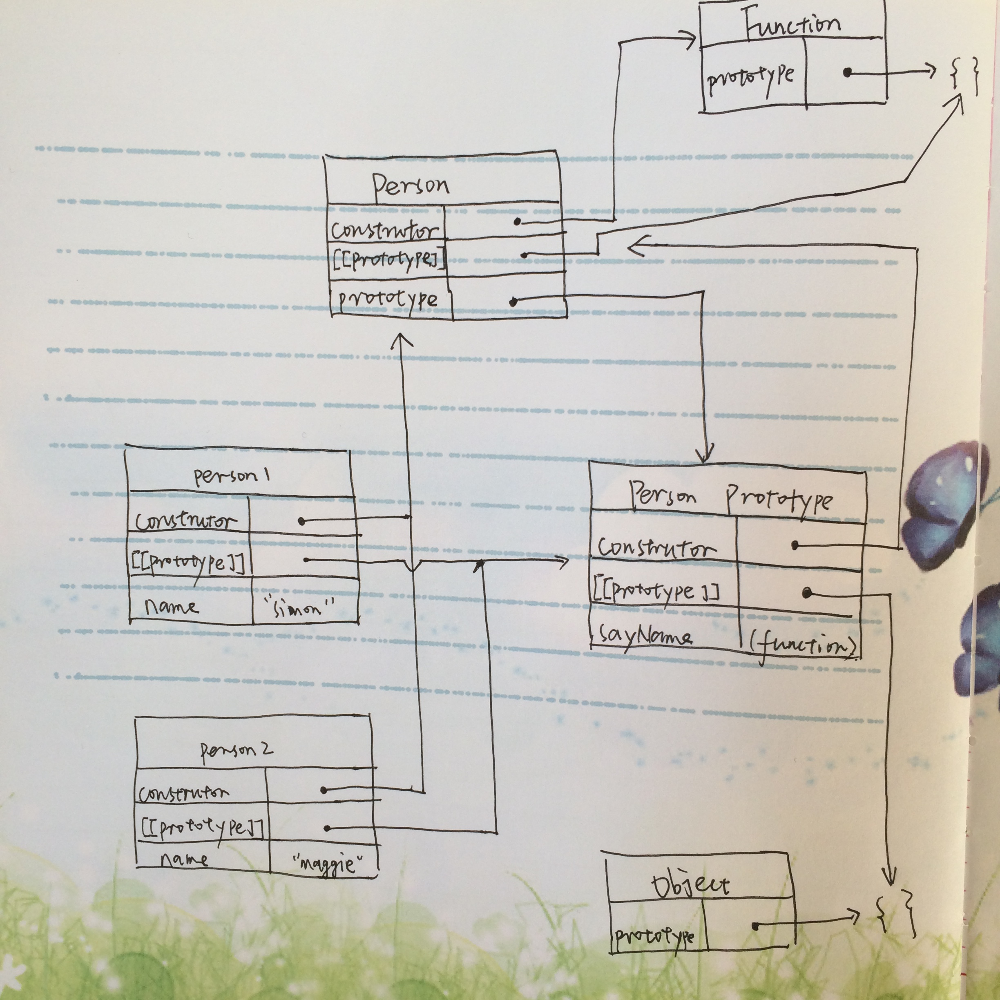
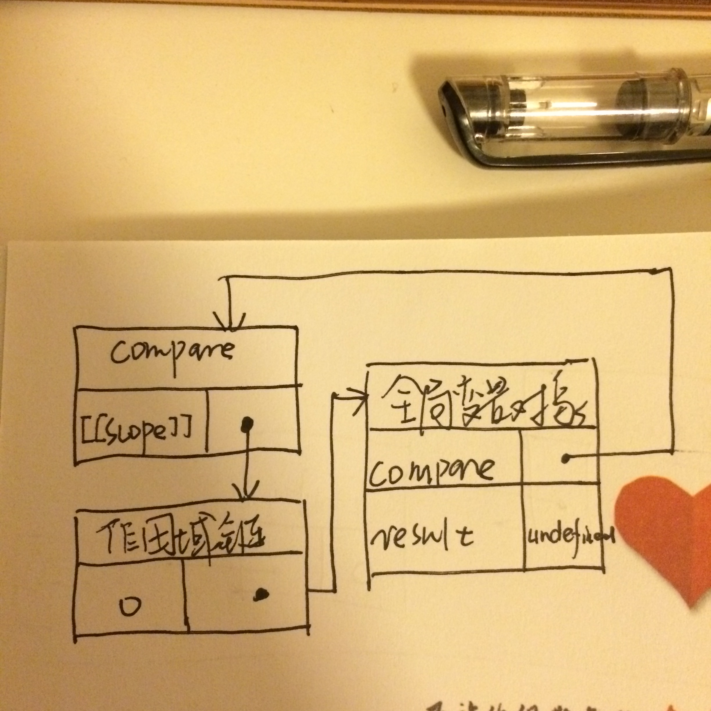
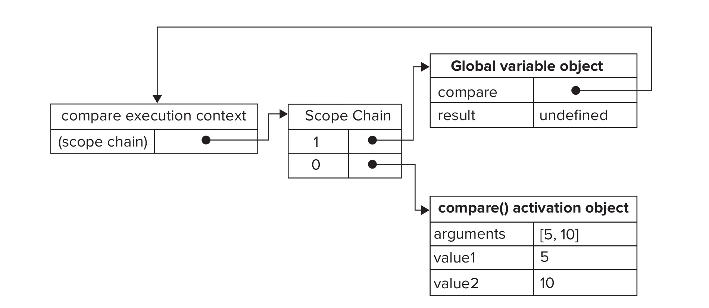

# Professional JavaScript

## 第一章 JavaScript 简介

### js 和 ECMAScript 的关系

完整的JavaScript应该由一下三个不同的部分组成:

- ECMAScript
- DOM
- BOM

## 第二章 在 HTML 中使用 JavaScript

### 2.1 `<Script>` 标签

书上说引入外部 js 文件的语句为:  
`<script type="text/javascript" src="path/to/js"></script`  
但其实在 html5 规范里, type那部分已经推荐省略了, 因为 web 就 js 一种脚本类型.

只有外部脚本才有defer/async属性:  
defer 属性可以让脚本延迟到整个页面都解析完毕后再运行, 效果和"把script标签放在 body 闭合标签之前"一样.  
async 属性可以让脚本异步执行(因此, 并不保证多个脚本的执行先后顺序). 异步脚本一定会在 load 时间前执行, 但不一定在 DOMContentLoaded 事件前执行.

load 和 DOMContentLoaded 事件的区别:

- load 表示尘埃落定
- DOMContentLoaded 不用等待图片/ flash/inframe 等加载完成, 更适合普遍的场景.

### 2.3 文档模式

IE5.5 中, 文档类型 doctype 用于切换文档模式. 最初的两种文档模式是:

- 混杂模式(quirks mode): 让 IE 的行为和 IE5 相同
- 标准模式(standards mode): 让 IE 的行为更接近标准行为

如果在文档开始处没有发现文档类型声明, 则所有浏览器都会默认开启混杂模式. html5 中开始标准模式的代码为: `<!DOCTYPE html>`

## 第三章 基本概念

### 3.1 语法

令我意外的是, **IE BUGS**: IE10+ 才开始支持严格模式.

### 3.3 变量

**变量提升: 只提升定义, 不提升赋值!**

```javascript
// undefined
console.log(a)
var a = 1
```

思考以下代码的输出:

```javascript
var foo = 1
function bar() {
    if (!foo) {
        var foo = 10
    }
    alert(foo)
}
bar()
```

```javascript
var a = 1
function b() {
    a = 10
    return
    function a() {}
}
b()
alert(a)
```

**疑问**: 为什么访问不存在的变量会报错, 而访问不存在的属性却返回 undefined?

```javascript
// Error
console.log(nonexistValue)

// undefined
console.log(window.nonexistValue)
```

### 3.4 数据类型

typeof 是个操作符, 而不是函数, 可以用来检测给定变量的数据类型. 而且 `typeof null` 得到的是object, 因为特殊值 null 被认为是一个空的对象引用. undefined 派生自 null, 因此 ECMAScript 规定他们的相等性(双等号)测试要返回 true.

js 里没有 Integer 类型, 全部的数值都是浮点数, 像数组下标之类的场合必须要整数时, 会把浮点数转化为32位整数. Number(), parseInt(), parseFloat 都可以将字符串转化为数值. Numebr() 和 parseInt() 的一个大区别是:

- 如果有前导空格, Number 会将它转化为 NaN, 而 parseInt 则直接从第一个非空格字符开始.
- Number 会将空字符转化为0, 而 parseInt 转化为 NaN

书上说: **由于 Number 函数在转换字符串时比较复杂而且不够合理, 因此在处理整数时更常用的是 parseInt 函数.**

JavaScript 中的字符串时不可变的, 和 c 语言的字符数组不一样. 要更改字符只能新建一个. 要将一个数值转化为字符, 可以用  Obj.toString() 方法, 这样有个不足, 就是 null 和 undefined 没有这个方法. 因此在不确定的情况下, 用 String() 较为稳妥.

```javascript
var a = 110
a.toString()
var b = null
String(b)
```

### 3.5 操作符

位操作符会先把操作数转化为32位整数数值, 因此可能伴随着精度的丢失. 而且会把 NaN 和 Infinity 转化当成0来处理. 因此:

```javascript
var a = NaN
// -1
~NaN
```

有符号右移 `>>`, 无符号右移 `>>>`

乘性操作符有些比较违反直觉:

- **Infinity 和 0 相乘, 结果是 NaN**
- **任何非零的有限数被零除, 结果是 Infinity 或者 -Infinity**

加性操作符:  
如果有一个操作数是字符串, 那会把另一个操作数通过 toString 方法也转成字符串.

而关系操作符恰恰相反, 如果有一个操作数是数值, 那会把另一个操作数通过 Number() / valueOf() 先转化为数值再比较.

相等操作符(==): 会进行隐式类型转化, 1 会等于 "1". 但是相等操作符不会把 null 和 undefined 转化为其他值, 也就是说 undefined 不等于 "undefined". 特殊值里, Infinity == Infinity

js 里还有另一朵奇葩, 就是逗号操作符. 正常使用时可以使用逗号操作符在同一语句中执行多个操作, 但用多个值对一个变量赋值时, 逗号操作符总会返回表达式中的最后一项.

```javascript
var num1 = 1,
    num2 = 2,
    num3 = 3

// num 的值为0
var num = (5, 1, 4, 8, 0)
```

### 3.6 语句

for-in 语句不是拿来做循环的, 而是用来枚举对象的属性.

switch 语句在比较值是使用的是全等操作符, 不会发生类型转化.可以使用任何数据类型, 还可以使用表达式.

```javascript
var num = 25
switch (true) {
    case num < 0:
        console.log("Less than 0")
        break
    case num > 0:
        console.log("Greater than 0")
        break
    default:
        console.log("equal 0")
}
```
### 3.7 函数

ECMAScript 的参数的内部表示是一个数组(arguments 数组), 函数接收的只是这个数组, 而数组有几个值函数不关心. 因此声明函数时可以接收2个参数, 但在调用时可以传递1个, 3个甚至不传递参数. 反过来也一样, 可以在定义时不加参数, 再调用时加参数.

函数的 arguments 还有个特点, **它的值永远和对应命名参数的值保持同步, 但是事实上他们访问的是独立的内存空间**.

```javascript
function demo(num1, num2) {
    console.log(arguments[1])
    num2 = "changed"
    console.log(arguments[1])
}
demo(1,2)
```

因为 ECMAScript 类型松散, 对参数又不关心, 因此没法区分多个同名函数, 也就是说, js 里没有重载.

未指定返回值的函数返回的是一个特殊的 undefined 值.

## 第四章 变量/作用域和内存问题

### 4.1 基本类型和引用类型

基本类型的复制会复制一个额外的副本, 引用类型的复制会复制指针.

参数传递和复制一样. 对于引用类型来说, 参数传递的是指针, 所以**可以在函数里可以直接修改外部引用类型的值**. 但是, 即使如此, 参数传递仍然是按值传递: 如果在函数里将引用类型的地址改变, 如果是按引用传递, 那么外部的值也会改变, 但是 js 里并不会.

NaN 是比较界的一个奇葩, 任何数(包括 NaN 它自己)和它比较, 结果都是 false.

```javascript
var person = {
    name: "simon"
}

function demo(p) {
    p = new Object()
    p.name = "changed"
    return p
}

console.log(demo(person).name)
console.log(person.name)
```

### 4.2 执行环境和作用域

执行环境的类型只有两种: 全局和局部.

每个执行环境(execution context)都是一个与之关联的变量对象(VO: variable object), 在某个执行环境中的所有代码执行完毕后, 该环境被销毁, 保存在其中的所有变量和函数定义也随之销毁.

当代码在一个执行环境中执行时, 会创建变量对象的一个作用域链(scope chain), 用于保证对执行环境有权访问的所有变量和函数的有序访问. 作用域链的最前端, 始终都是当前执行的代码所在环境的变量对象. 最后一个对象, 始终是全局执行环境的变量对象.

如果执行环境是函数, 则将其活动对象( AO: activation object ) 作为变量对象, AO 在最开始时只包含一个变量, 即 arguments 对象.

**如何确定 this?**  

```javascript
var color = "red"
function demo() {
    var color = "blue"
    // console.log("局部执行环境里的 color: ", color)
    console.log(this.color)
}
// red
demo()
```

在 javascript 中, 函数的调用一共有四种方式, 不同的调用决定了 this 的值:

- Function Invocation Pattern

    诸如`foo()`的调用形式被称为Function Invocation Pattern，是函数最直接的使用形式，注意这里的foo是作为单独的变量出现，而不是属性。 在这种模式下，foo函数体中的this永远为Global对象，在浏览器中就是window对象。  
    就算闭包中的 this 指的也是 global.

    ```javascript
    var color = "red"
    function demo() {
        let color = "blue"
        let inside = function () { console.log(`this.color: ${this.color}`) }
        let inside2 = function () { console.log(`color: ${color}`) }
        inside()
        inside2()
    }
    //this.color: red
    //color: blue
    demo()
    ```

- Method Invocation Pattern

    诸如`foo.bar()`的调用形式被称为Method Invocation Pattern，注意其特点是被调用的函数作为一个对象的属性出现，必然会有“.”或者“[]”这样的关键符号。 在这种模式下，bar函数体中的this永远为“.”或“[”前的那个对象，如上例中就一定是foo对象。

- Constructor Pattern

    `new foo()`这种形式的调用被称为Constructor Pattern，其关键字`new`就很能说明问题，非常容易识别。 在这种模式下，foo函数内部的this永远是new foo()返回的对象。

- Apply Pattern

    `foo.call(thisObject)`和`foo.apply(thisObject)`的形式被称为Apply Pattern，使用了内置的`call`和`apply`函数。 在这种模式下，`call`和`apply`的第一个参数就是foo函数体内的this，如果thisObject是`null`或`undefined`，那么会变成Global对象。

一个帮助理解 this 的例子:

```javascript
var a = 10
function demo() {
    a = 5
    console.log(a)
    console.log(this.a)

    var a //变量提升, a 变成了局部变量
    console.log(this.a)
    console.log(a)
}
// 5,10,10,5
demo()
// 5, undefined, undefined, 5
new demo()
```


**在集中特殊情况下, this 的值可能会意外的改变**:

```javascript
var name = "The Window"
var object = {
    name: "My Object",
    getName: function () { return this.name }
}
object.getName() // "My Object"
(object.getName)() // "My Object"
(object.getName = object.getName)() // "The Window"
```

最后一行的执行结果之所以是"The Windows", 是因为赋值语句是有返回值的, 这里的返回值是

```javascript
function() { return this.name }
```

因此`(object.getName = object.getName)()`的写法执行的 pattern 是 Function Invocation Pattern.

es6 带来了箭头函数, 箭头函数是唯一的不由调用决定 this 的特殊情形. 箭头函数在设计中使用的是 Lexical this, 即这个函数被创建时的 this 就是函数内部的 this. **注意, "函数创建时"的意思指的并不是"一个读代码的人肉眼看到这个函数的时候"**, 如:

```javascript
function printThis() {
    let print = () => console.log(this)
    print()
}
// [1]
printThis.call([1])
// [2]
printThis.call([2])
```


**注意**: nodejs 文件中, this 的值并不等于 global, 而是等于 module.exports. 但是通过输入 node 进入到的执行环境里, this 的值等于 global.


### 4.3 垃圾收集

- 标记清除(主流方法)
- 引用计数(无法解决循环引用的问题)

### IIFE

因为 js 只有两种作用域, 没有块级作用域. 因此为了避免污染全局空间, 通常用函数作用域来模拟块级作用域.比如:

```javascript
var a = 10
var b = 20
console.log(a + b)

// 为避免污染, 将以上代码改成
fuction demo() {
    var a = 10
    var b = 20
    console.log(a + b)
}
demo()
```

但是这种方法仍然在全局空间引入了 demo 这个函数, 因此更好的方法是利用匿名函数, 而且马上执行(因为随后没有办法引用这个匿名函数了):

```javascript
function () {
    var a = 10
    var b = 20
    console.log(a + b)
}()

// 以上代码会出错, 因为 js 将 function 关键字当做一个函数声明的开始
//而函数声明后面不能跟圆括号. 然而, 函数表达式可以跟圆括号.
//将函数声明转换成函数表达式, 只要将它用圆括号包围即可.
(function () {
    var a = 10
    var b = 20
    console.log(a + b)
 })()
```

这种表达式称为 IIFE(Immediately Invocation Function Expression)

## 第五章 引用类型

### 5.1 Object 类型

**IE BUGS**: 对象的字面量表示法, 请不要在最后一个属性后加上逗号, 否则会在 IE7及更早版本和 Opera 中导致错误.

除了常用的点表示法来访问对象的属性, 还可以用方括号来访问属性. 方括号的特别之处在于可以访问到属性名中包含空格等非字母非数字的属性名.

### 5.2 Array 类型

**IE BUGS**: 在用数组字面量表示法声明数组时, 不要在最后一项后添加空格: `var values = [1, 2,]`, 也不要生成空的数组: `var options = [,,,,]`, 否则会在不同浏览器中得到不一样的数组长度. IE8 及更早版本对待上述声明和标准不一致, [1,2,].length 在标准浏览器中是2, 而在bug 浏览器中是3.

和 c 不同, js 没有数组越界的说法, 如果某个值的索引超过了数组长度, 则数组会自动增加到该索引加一的长度. 而且, 它的 length 属性很有特点, 居然不是只读的! 利用这个特点可以方便地在数组末尾添加新项(但其实也没有 push 方法方便直观).

数组的一些方法:

- Array.isArray()

    这个方法可以避免 instanceof 在多个框架中传递数组时, 由于不同版本的 Array 构造函数导致判断错误的缺点.

- toString() / valueOf() / join()

    **IE BUGS**: IE7及更早版本的 bug: 如果 join 方法不携带参数, 那么会用 "undefined" 作为分隔符.

- push() / pop()
- shift() / unshift()

    **IE BUGS**: 正常情况下, unshift 返回的是数组的新长度, 但是 IE7及更早版本总是返回 undefined

- reverse() / sort()

    sort 方法很不科学地先调用每个数组项的 toString 转型方法, 然后再比较. 如果你想排序数组, 务必要自己定义 compare 方法, 一个简单的例子为:

    ```javascript
    function compare(value1, value2) {
        return value2 - value1
    }
    ```

- concat() / slice() / splice()

    concat 的参数如果是一个或者多个数组, 则会将数组的每一项都复制到结果数组中.  

    #### Element 类型
    slice 方法的第二参数所指示的索引并不被包含在结果数组中. 如果是负数, 则用数组加上该数来确定相应的位置. 如果结束位置小于起始位置, 则返回空数组. 这点和 String 类型的 slice 方法不一样!
    splice 方法可以用来删除,插入和替换, 只需传入2个参数或者3个参数即可.

- indexOf() /lastIndexOf()

    都接收两个参数. indexOf 从指定的位置向后查找, lastIndexOf 从指定位置向前查找. 而且, 在查找的比较过程中, 用的是全等操作符 `===`

- every() / filter() / forEach() / map() / some()

    如果是类似 [,,,] 或者 [1,,3,4] 这类有"空隙"的数组, 要小心, 空隙的数组项不会执行你传递的函数.

    ```javascript
    > var value = [,,,]
    > value.map((item, index, array) => {
    ... return 0
    ... })
    [ , ,  ]
    ```

- reduce() / reduceRight()

    如果有初始值参数, 那么迭代从第一项开始, 否则从第二项开始. 传递给它们的参数接收四个参数: prev, cur, index, array

### 5.3 Date 类型

```javascript
new Date()
new Date(value)
new Date(dateString)
new Date(year, month[, day[, hour[, minutes[, seconds[, milliseconds]]]]])
```

有个坑, **注意月份从 0 开始**

### 5.4 RegExp 类型

- `var pattern = /cat/gim`
- 字面量表示法中, 元字符需要进行转义: `([{^$|?*+.}])`
- 如果用构造函数的方法声明 RegExp 类型, 那么要记得 RegExp 的参数是字符串. 而且所有元字符都要双重转义
- ECMAScript 5 开规定, 使用正则表达式字面量必须像调用 RegExp 构造函数一样, 每次都创建新的 RegExp 实例. IE9+ 对此都做了修改.
- exec()

    只返回第一个匹配项信息的数组, 即使加了 g 标志. 这个结果数组还包含两个额外属性: index / input.数组的第0项是与整个模式匹配的字符串, 其余项是与模式中的捕获组相匹配的字符串. 如果没有 g 标志, 那么无论运行多少次 exec, index 属性都不会变化( IE 除外 )

- test()

    简单测试是否匹配, 不关心匹配的具体文本.

- 正则表达式的 valueOf 方法返回正则表达式本身.
- RegExp 构造函数的属性
- ECMAScript 正则表达式的局限性

### 5.5 Function 类型

- js函数没有重载
- 函数声明有提升, 可以在执行任何代码之前访问, 而函数表达式必须等到解析器执行到它所在的代码行才会真正被解释执行.
- 函数内部有两个特殊的对象: arguments 和 this

    arguments 对象有一个 callee 属性, 指向拥有这个 arguments 对象的函数, 这个特性可以用来消除函数名称的耦合, 但是在严格模式下访问 arguments.callee 会导致错误.  
    this 对象值得是函数据以执行的环境对象, 注意, **是函数的外部对象!**  

- 函数的属性

    length 属性表示函数希望接收的命名参数的个数;  
    prototype 是保存某个类型的所有实例方法的真正所在, 在 es5 中, prototype 是不可枚举的, 因此用 for-in 无法发现.  
    此外, 还有一个函数对象的属性 caller, 它保存着调用当前函数的函数的引用.

- 函数的方法

    apply 和 call 的区别在于传递参数的方式的不同. apply 传递 arguments 对象或者参数数组, call 逐个传递参数.  
    bind 方法.

### 5.6 基本包装类型

- 为什么基本类型也有方法?( 后台过程 )

    1. 创建类型的一个实例
    2. 在实例上调用指定的方法
    3. 销毁这个实例

- 永远不要使用 Boolean 对象! 为什么? (对象在测试时的值/ typeof)
- 不建议实例化 Numebr 类型. 为什么? (typeof)
- 如何访问字符?

    **IE BUGS**: 如果用方括号访问字符, 小心 IE7, 他会返回 undefined

- slice / substr / substring 的区别

    slice 和 substring 的参数表示起始位置和结束位置+1. 而 substr 的第二个参数表示的是字符个数. 此外他们对待负数参数的行为区别也很大. slice 对待负数和数组的 slice 方法大抵相同, 有个细微的区别是, Array.slice 如果结束位置小于起始位置, 会返回空数组, 而 String.slice 始终会把较小的数字作为开始位置. String.substring 会将所有负数转化为0. String.substr 将负的第一个参数加上字符串长度, 将负的第二个参数变成0.  
    **IE BUGS**: 9以下的 IE 中, substr 的行为和 substring 一样, 都会把所有的负数转化为0.

- indexOf / lastIndexOf, 和 Array 的方法一样
- trim

    **IE BUGS**: 仅在 IE9 以上才有这个方法.  
    此外, 现代浏览器还支持非标准的 trimLeft / trimRight 方法

- toUpperCase / toLowerCase
- match / search / replace / split

    String.match 本质上和调用 RegExp.exec 相同. 而 search 方法用于简单地查找 pattern 匹配的位置. replace 可以批量进行替换, 该方法第一个参数表示要匹配的 pattern, 而第二个参数可以是字符串,表示要替换成的字符串, 这个字符串可以使用一些特殊的字符序列:

    ```
    $$: $
    $&: 匹配整个模式的字符串
    $`: 匹配的子字符串之前的子字符串.
    $': 匹配的子字符串之后的子字符串
    $n: 匹配第 n 个子字符串
    ```

    **坑**: 其实很简单, 别把自己绕进去了.

    ```javascript
    "cat, bat, sat, fat".replace(/at/g, "$`xx")
    "ccxx, bcat, bxx, scat, bat, sxx, fcat, bat, sat, fxx"
    ```

    String.replace 的第二个参数也可以是函数, 该函数接收3个参数: 模式的匹配项, 匹配项在字符串中的位置,原始字符串.  
    String.split 的第一个参数可以是正则表达式或者字符串, 可选的第二个参数表示结果数组的大小.  
    **IE BUGS**: 在低版本的 IE 中, split加上字符串参数工作良好. 但是如果split 的参数是正则表达式的话, IE 会吞掉结果数组的空字符串.

    ```javascript
    //IE: 0
    //Chrome: 4
    ",,,".split(/,/).length
    ```

- localCompare / fromCharCode

### 5.7 内置单体对象

内置对象: "有 ECMAScript 实现提供的, 不依赖宿主环境的对象, 这些对象在 ECMAScript 程序执行之前就已经存在."

- Global 对象

    isNaN, isFinite, parseInt, encodeURI, encodeURIComponent 等等都是 Global 对象的方法. encodeURI 和 encodeURIComponent 的区别在于, encodeURI 不会对本身属于 URI 的特殊字符进行编码(如http://中的冒号和斜杠), 而 encodeURIComponent 会. 因此一般用 encodeURI 编码整个地址, 而 encodeURIComponent 用于编码参数列表.

    eval 方法中被执行的代码具有eval 同等的执行环境.

    取得 global 对象, 在浏览器中使用window对象, 在 nodejs 中使用 global 对象. 或者使用代码来获取:

    ```javascript
    var global = function () {
        return this
    }()
    ```
- Math 对象

    Math.PI, Math.E, Math.max, Math.min, Math.random, Math.floor...等等. 如何取得一个数组的最大值?

    ```javascript
    // 注意把 Math 作为第一个参数, 正确设置 this 的值
    Math.max.apply(Math, [1,2,3,9,2])
    ```

## 第六章 面向对象的程序设计

### 6.1 理解对象

对象属性的类型只有两种, 一种是数据属性(可以放值), 另一种是访问器属性.
创建对象的数据属性除了常用的对象字面量和构造函数模式之外, 还可以利用Object的两个方法:

- Object.definePropterty
- Object.definePropterties

创建对象的访问器属性, 只能用 Object 的这两个方法, 无法用字面量方式创建.

除了创建对象属性, Object.definePropterty 和 Object.definePropterties 还可以指定属性的特性. 对于数据属性来说, 特性有:

- [[Configurable]]
- [[Enumerable]]
- [[Writable]]
- [[Value]]

对于访问器属性来说, 特性有:

- [[Configurable]]
- [[Enumerable]]
- [[Get]]
- [[Set]]

访问器属性比较少见, 举个例子:

```javascript
var book = {
    _year: 2004,
    edition: 1
}

// 注意 "year" 参数的括号!
Object.definePropterty(book, "year", {
    get: function () {
        return this._year
    },
    set: function (newValue) {
        if (newValue > 2004) {
            this._year = newValue
            this.edition += newValue - 2004
        }
    }

})
```

只指定 getter 意味着属性不能写, 尝试写入会被忽略; 只指定 setter 意味不可读, 否则得到 undefined. 严格模式下, 尝试写入/读取没有 setter/getter 的属性会抛出错误.

此外,还有一个 API: Object.getOwnPropertyDescriptor() 可以取得给定属性的描述符.

**IE BUGS**: IE9+才有这些 API

### 6.2 创建对象

二逼青年创建多个对象:

```javascript
// 二逼青年,重复 n 次
var p1 = {
    name: "someone",
    age: 20,
    sayName: function () {
        console.log(this.name)
    }
}
```

普通青年把二逼青年的重复代码提取出来:

```javascript
// 普通青年: 工厂模式
function createPerson(name, age) {
    var p = {}
    p.name = name
    p.age = age
    p.sayName = function () {
        console.log(this.name)
    }
    return p
}
var p1 = createPerson("someone", 20)
```

这种普通青年的代码称为"工厂模式", 还有另一种普通青年, 在新建对象的方法上有所不同. 他们通过 `var p2 = new createPerson("someone", 20)` 来构造实例, 称为"寄生构造模式", 这种方法虽然用了接下来要提到的 `new` 关键词, 但是并不能通过 `instanceof` 操作符确定实例的类型.

普通青年的模式仍然有重复代码, 每次都要创建和返回一个对象. 文艺青年把这步也给省略了:

```javascript
// 文艺青年: 构造函数模式
function Person(name, age) {
    // var this = {}
    this.name = name
    this.age = age
    this.sayName = function () {
        console.log(this.name)
    }
    // return this
}
var p1 = new Person("someone", 20)
```

这种方式称为"构造函数模式". 其中, 必须要用 new 关键词告诉 js 引擎, 让引擎帮我们自动创建和返回对象. 否则的话, 直接调用,  this 就指向了全局对象; 如果用call/apply 方式调用, 那this 就指向了绑定的对象.

文艺青年不但精简了代码, 而且构造函数模式可以将实例标识为一种特定的类型:  
`console.log(p1 instanceof Person) // true`

但是文艺青年的代码仍然有提高的空间, 不要忘了, 函数也是对象, 因此每个 sayName 指向的都是一个 Function 对象的实例. 从逻辑角度讲, 其中的  
`this.sayName = function () { console.log(this.name) }`  
可以这样定义:  
`this.sayName = new Function("console.log(this.name)")`

可以验证 Person 的不同实例的同名函数是不相等的:  
`console.log(person1.sayName == person2.sayName) // false`

文艺青年可以这样优化:

```javascript
function sayName() {
    console.log(this.name)
}
function Person(name, age) {
    this.name = name
    this.age = age
    this.sayName = sayName
}
var p1 = new Person("someone", 20)
```

带来的新问题是:

- 全局作用域中定义的函数实际上只能被某个类型的对象使用, 全局函数名不副实.
- 如果对象需要定义很多方法, 那么就要定义很多全局函数, 这个类型没有封装性可言, 同时污染全局空间.

**原型模式**

无论什么时候, 只要创建了一个函数 Demo, 就会同时构造创建一个隶属于它的原型对象.原型对象是 Object 的实例, 而不是构造函数 Demo 的实例, 虽然原型对象的 constructor 指向的是函数 Demo. 原因在于 instanceof 不是依靠 constructor 的指向来判断对象是不是某个类型 Demo 的实例, 而是根据 Demo 的原型对象在不在该实例的原型链上来决定.

```javascript
function Animal(name) { this.name = name }
var person = new Person("someone", 20)
Animal.prototype = Person.prototype
// true
person instanceof Animal
person.__proto__ = new Object()
// false
person instanceof Person
```

原型对象默认只会取得 constructor 属性, 其他属性/方法都是从 Object 继承而来.


ECMAScript 里每个对象(函数也是对象!原型也是对象!)都有的几个属性之2:

- `constructor`: 保存着用于创建当前对象的函数.
- `[[Prototype]]`: 一个内部指针, 指向实例的构造函数的原型对象. 在 Firefox, Safiri 和 Chrome 中, 这个属性可以通过 `__proto__` 属性访问. 也可以通过 `Object.getPrototypeof( person1 )` 来获得.

如果是 Function 对象, 那么还有个 prototype 属性, 指向它的原型对象.

用之前的例子进行说明, 构造函数 Person 的属性, 其原型对象的属性, 其实例的属性以及这三个实例(别忘了函数也是 Function 的一个实例)的关系如下:



读实例的属性时, 先从实例本身开始搜索, 如果找到了该属性, 则返回值. 否则搜索指针指向的原型对象. 写属性时, 无法通过实例重写原型中的值, 如果在实例中添加了一个属性, 而该属性与实例原型中的一个属性同名, 那么我们就在实例中创建该属性, 该属性将会屏蔽原型中的那个属性.

如何确定一个属性存在于实例中还是存在于原型中?

- `person1.hasOwnProperty("name")` 可以确定一个属性存在于实例中.
- `name in person1` 无论一个属性存在于实例还是原型, 都返回 true
- 因此可以用 `!person1.hasOwnProperty("name") && ("name" in person1)` 来确定一个原型只存在于原型中.

介绍完原型, 就可以知道用原型模式创建对象的方式了:

```javascript
function Person() { }

Person.prototype.name = "simon"
Person.prototype.age = 29
Person.prototype.sayName = function () { console.log(this.name) }
```

每次都写一堆 `Person.prototype`前缀, 还可以更偷懒:

```javascript
function Person() { }

Person.prototype = {
    constructor: Person,
    name: "simon",
    age: 29,
    sayNmae: function () { console.log(this.name) }
}
```

重写原型之后, 新原型对象的 constructor 不再指向Person( 而是指向 Object ), 虽然 constructor 一般也没什么用, 但是如果重要的话, 可以在新原型对象中进行恢复原来的指向.

原型中的属性是被很多实例共享的, 如果这个属性是引用类型的属性, 问题就突出了:

```javascript
function Person() {}
Person.prototype = {
    name: "simon",
    friends: ["some", "other"]
}
```

问题在于某个实例添加了朋友, 其他实例也被同步. 因此都是"组合使用构造函数模式和原型模式", 构造函数用于定义实例属性, 原型模式用于定义方法和共享的属性:

```javascript
// 理科青年: 组合使用构造函数和原型模式
function Person(name, age) {
    this.name = name
    this.age = age
}
Person.prototype.sayName = function () { console.log(this.name) }
```

强迫症早期看到理科青年的代码觉得很难受, 问理科青年: "尼玛方法居然在构造函数外面!", 理科青年表示"我也没办法啊, 封在里面的话每创建一个实例都要对原型进行一次属性赋值, 每次都构建函数实例影响性能呀", 强迫症表示"我要把他们封装到一起!":

```javascript
// 强迫症早期: 动态原型模式
function Person(name, age) {
    this.name = name
    this.age = age

    if (typeof this.sayName != "function") {
        Person.prototype.sayName = function () { console.log(this.name) }
    }
}
```

这下好了, 只有第一次创建实例时才操作原型, 其余的创建都只需要用 typeof 判断一次就行. 强迫症早期满意了, 晚期患者也一样不舒服, "每次构建实例居然都要判断!", 于是改写成这样:

```javascript
// 强迫症晚期: IIFE + 原型模式
var Person = (function() {
    function Person(name, age) {
        this.name = name
        this.age = age
    }
    Person.prototype.sayName = function () { console.log(this.name) }

    return Person
})()
```

### 6.3 继承

之前说过, 在原型对象上定义引用类型的属性不可取, 以免被多个实例共享. 然而使用原型链技术进行继承, 即使父类的引用类型定义在实例上, 也会有问题. 原因在于父类的实例成了子类的原型.

```javascript
// 普通青年: 单独使用原型链实现继承
function SuperType() {
    this.colors = ["red", "blue", "green"]
}
function SubType() { }

SubType.prototype = new SuperType()

var sub1 = new SubType()
var sub2 = new SubType()
sub1.colors.push("black")
console.log(sub2.colors)
```

此外, 原型链继承还有另外一个问题: 在创建子类型的实例时, 无法向超类的构造函数传递参数.

文艺青年通过在子类的构造函数里调用父类的构造函数来弥补普通青年的不足:

```javascript
// 文艺青年: 借用构造函数
function SuperType() {
    this.colors = ["red", "blue", "green"]
}
function SubType() {
    SuperType.call(this)
}
```

但是这么做就不能认定 sub1 是 SuperType 的实例了. 而且, 定义在父类原型对象上的方法, 都无法被 SubType 的实例访问, 只能把所有方法都定义在构造函数里, 毫无函数复用可言. 文艺青年的方案和普通青年一样无用.

理科青年比他们都要靠谱, 他的思路和创建对象时一致, 就是组合普通青年和文艺青年的做法, 用原型链实现对原型属性和方法的继承, 同时通过构造函数来实现对实例属性的继承:

```javascript
// 理科青年: 组合继承
function SuperType() {
    this.colors = ["red", "blue", "green"]
}
SuperType.prototype.sayColors = function () { console.log(this.colors) }

function SubType(age) {
    SuperType.call(this)
    this.age = age
}
SubType.prototype = new SuperType()
SubType.prototype.constructor = SubType
SubType.prototype.sayAge = function () { console.log(this.age) }
```

通过以上代码, 虽然子类的原型对象中仍然包含了引用类型 colors, 但是子类的实例中也包含了 colors 属性, 该属性屏蔽了原型中的属性, 从而避免了共享属性的问题. 由于优点明显, 理科青年的方法成为了 js 中最常用的继承方法.

但是懒癌早期患者克罗克福认为, 当我只想从原有的一个对象派生出几个对象的时候, 还需要定义超类构造函数, 子类构造函数, 太啰嗦了. 直接将已有的对象作为新对象的原型对象即可, 并称之为"原型式继承"

```javascript
// 懒癌早期: 原型式继承
var person = {
    name: "simon",
    friends: ["some", "other"]
}

var anotherPerson = Object.create(person)
anotherPerson.name = "maggie"
anotherPerson.sayName = function () { console.log(this.name) }
// true
anotherPerson.__proto__ == person

var yetAnotherPerson = Object.create(person)
yetAnotherPerson.name = "Linda"
yetAnotherPerson.sayName = function () { console.log(this.name) }
yetAnotherPerson.friends.push("Van")

console.log(anotherPerson.friends)
```

虽然"原型式继承"可以偷懒不用定义构造函数, 但是没能解决属性的共享问题.(除非在新对象上新建同名属性, 对原型属性进行屏蔽). 克罗克福到了懒癌晚期, 他觉得每次都在新对象上对 sayName 属性进行赋值很累, 像工厂模式/寄生构造函数一样把 sayName 属性也封装起来吧, 这称为"寄生式继承".

```javascript
// 懒癌晚期: 寄生式继承
function createAnother(original) {
    var clone = Object.create(original)
    clone.sayName = function () { console.log(this.name) }
    return clone
}
```

但是!每个实例都重复定义了一个 sayName 函数, 没有函数复用. 可见懒癌患者的这两种方法远不及组合式继承那么实用.

组合式继承优点很多, 但是也有它自己的缺点:
由于子类原型对象是超类的实例, 因此也拥有超类的实例属性, 同时子类的构造函数调用父类构造函数, 因此也有超类的实例属性, 虽然这样解决了属性共享的问题, 但是对于强迫症来说似乎有点冗余. 如果子类的原型不包含超类的实例属性就好了, "原型对象上只定义方法"这才是最佳的状态. 这种状态可以用"寄生组合式继承"来达到:

```javascript
// 强迫症晚期: 寄生组合式继承
function inheritPrototytype(subType, superType) {
    var prototype = Object.create(superType.prototype)
    prototype.constructor = subType
    subType.prototype = prototype
}

function SuperType() {
    this.colors = ["red", "blue", "green"]
}
SuperType.prototype.sayColors = function () { console.log(this.colors) }

function SubType() {
    SuperType.call(this)
    this.age = 20
}

// 近似等价于: SubType.prototype = Object.create(SubType.prototype)
inheritPrototytype(SubType, SuperType)

SubType.prototype.sayAge = function () { console.log(this.age) }

var sub1 = new SubType()
```

开发人员普遍认为寄生组合式继承是引用类型最理想的继承范式.

## 第七章 函数表达式

### 7.1 递归

一般情况下, 可以用 arguments.callee 来解除递归函数的函数名称的耦合. 但是在严格模式下, 这个方法不管用, 一个更恰当的方法是: 命名函数+函数表达式

```javascript
var factorial = (function f(num) {
    if (num <= 1) {
        return 1
    } else {
        return num * f(num - 1)
    }
})
```

### 7.2 闭包

js 里的类没有权限控制, 全部属性和方法都是公有的. 但是, 倒是有一个私有变量的概念, 任何在函数中定义的变量, 都可以认为是私有变量, 因为不能再函数外部访问这些变量. 闭包可以访问外部函数的变量, 因此被广泛用来访问私有变量.

先来理解作用域链:

后台的每个执行环境都有一个表示变量的对象: 变量对象. 全局执行环境的变量对象始终存在, 而函数的执行环境对象只有在函数执行的过程中才存在.

在函数创建时, 就会创建一个作用域链, 其中只包含全局变量对象. 为什么不包含局部变量对象呢? 因为函数没执行, 它参数的值未知, 只能当已知的时候再添加到链上来了. 这个作用域链被保存在内部的 `[[ Scope ]]` 属性中.

```javascript
function compare(value1, value2) {
    return value1 - value2
}
var result = compare(5, 10)
```

创建 compare 函数时, 它的作用域链如图:



调用函数时, 开始创建执行环境: 首先把 `[[ Scope ]]` 属性中保存的作用域链复制过来(其实就是复制指针). 由于 arguments 已经确定, 所以构建活动对象( 开始仅包含 arguments). 最后把活动对象推到作用域链的最前端. 而且为了性能, 作用域链本质上只是一个指针列表, 只引用但不实际包含变量对象.

执行 compare 时, 它的执行环境如图:



当函数执行完毕后, 局部活动对象就会被销毁, 内存中仅仅保存全局变量对象.

**但是, 闭包的情况有所不同.**

"闭包是指有权访问另一个函数作用域中的变量的函数", 创建闭包的常见方式, 就是在函数内部创建另一个函数.

内部函数创建时会将外部函数的活动对象添加到它的作用域链中. 因此外部函数执行完毕后, 它的活动对象不会被销毁. 也正是因为闭包会携带包含他的函数的作用域, 闭包占用的内存过多.

```javascript
function createFunctions() {
    var result = []

    for (var i = 0; i < 10; i++) {
        result[i] = function () { return i }
    }

    return result
}
```

以上的例子, result 数组里的每个函数最后返回的都是10. 原因是函数的作用域链仅仅包含了指向变量对象的指针, 也就是说这10个闭包的作用域中所包含的外部函数变量对象都是同一个. 因此闭包只能取得外部函数的任何变量的最后一个值.

```javascript
function createFunctions() {
    var result = []

    for(var i = 0; i < 10; i++) {
        result[i] = (function (num) {
            return function() { return num }
        })(i)
    }

    return result
}
```

**闭包的坑: this**

匿名函数的执行环境具有全局性, 因此其 this 对象通常指向 window.

```javascript
var name = "The Window"

var object = {
    name: "My Object",
    getNameFunc: function() {
        return function() { return this.name }
    }
}
// "The Window"
console.log(object.getNameFunc()())
```

每个函数执行时都会自动取得两个特殊的变量 : this 和 arguments. 对于 getNameFunc 这个函数来说, 它的 this 值就是调用它的对象. 但是对于 getNameFunc 返回的这个闭包来说, 它的 this 值是global对象. 因此在执行这个闭包时, 位于作用域链首位的内部函数的 this 覆盖了外部函数的 this 值, 搜索变量 this 时只会搜索到其活动对象为止, 因此永远不可能直接访问外部函数的 this, 解决方法:

```javascript
var object = {
    name: "My Object",
    getNameFunc: function () {
        var that = this
        return function() { return that.name }
    }
}
```

### 7.3 模仿块级作用域( IEFE )

### 7.4 私有变量

以前说过, 闭包主要用来访问私有变量. 我们把有权访问私有变量和私有函数的共有方法称为特权方法.

创建特权方法的第一种方法是: 在构造函数中定义特权方法

```javascript
// 方法一: 在构造函数中定义特权方法
function MyObject() {
    var privateVariable = 10

    function privateFunction() {
        return false
    }

    // privileged method
    this.publicMethod = function () {
        privateVariable++
        return privateFunction()
    }
}
```

这种方法的缺点和原型模式创建对象一样: 无法做到函数复用. 每个实例的 publicMethod 都是重新创建的 Function 实例. 为了复用函数, 可以在构造函数外围再包裹一层"立即执行函数", 把私有变量和私有方法都放到外围函数中, 并把特权方法定义到对象的原型上:

```javascript
// 方式二: 在原型上定义特权方法
(function () {
    var privateVariable = 10

    function privateFunction() {
        return false
    }

    MyObject = function () {}

    MyObject.prototype.publicMethod = function () {
        privateVariable++
        return privateFunction()
    }
})()
```

虽然这个IEFE没有返回值, 但是 MyObject 被定义为一个全局变量, 因此可以在外部访问. 这种方式的特点是, 所有实例都共享一个静态变量, 没法新建独占属性. 方法一和方法二按实际情况选一个来用吧.

如果对象是单例, 那么还可以用"模块模式"和"增强的模块模式"来为单例添加私有变量和特权方法.

```javascript
// 模块模式
var singleton = function () {
    var privateVariable = 10

    function privateFunction () { return false }

    return {
        publicProperty: true,
        publicMethod: function () {
            privateVariable++
            return privateFunction()
        }
    }
}()
```

通过模块模式返回的对象是 Object 的实例, 如果对返回的对象的类型有要求, 可以使用"增强的模块模式":

```javascript
var singleton = function () {
    var privateVariable = 10
    function privateFunction() { return false }

    var object = new CustomType()
    object.publicProperty = true
    object.publicMethod = function () {
        privateVariable++
        return privateFunction()
    }
    return object
}()
```
