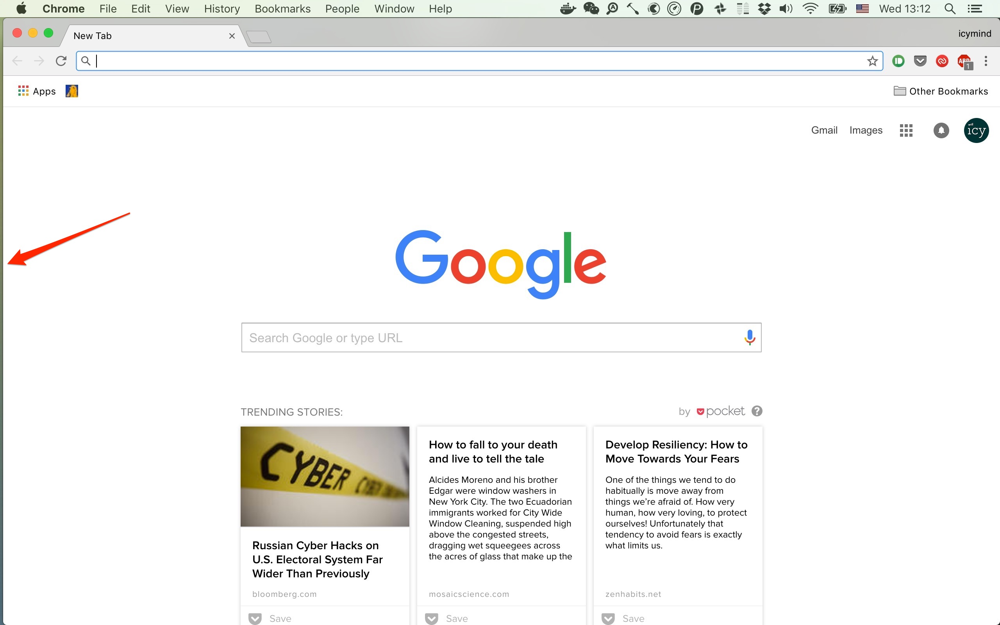

# Hammerspoon

hs 提供了很多 macOS 的 API, 可以用 lua 脚本对系统进行操作.

## 对 btt 的优势

- show/hide application 比 btt 要快
- expose 模式可以用键盘选择应用
- windows hints可以用键盘选择应用, 速度比 expose 快, 但是无法选择已经隐藏的应用
- 纯文本设定, 很方便同步.

## 对 btt 的劣势

- btt 可以方便的设定截图
- btt 可以定义按键序列(我用于查词)
- btt 可以方便的设定指定 app 的快捷键( hs 需要一堆繁琐的设定 )
- btt 的 snap, 用鼠标很方便

## 打开/隐藏应用

```lua
local key2app = {
    f = "com.apple.finder",
    c = "com.google.Chrome",
    i = "com.googlecode.iterm2",
    m = "org.vim.MacVim",
    t = "com.todoist.mac.Todoist",
    w = "com.tencent.xinWeChat"
}

-- misson control
---- show all: hyper + a
---- show windows: hyper + `
---- show desktop: hyper + x

hs.application.enableSpotlightForNameSearches(true)
for key, app in pairs(key2app) do
    hs.hotkey.bind(hyper, key, function()
        toggle_app(app)
    end)
end

function toggle_app(id)
    local app = hs.application.get(id)

    if not app then
        hs.application.launchOrFocusByBundleID(id)
        return
    else
        if app:isFrontmost() == true then
            app:hide()
        else
            app:activate(true)
            app:unhide()
            if app:mainWindow() ~= nil then
                app:mainWindow():focus()
            else
                -- when app has no window, create one by :
                hs.application.launchOrFocusByBundleID(id)
            end
        end
    end
end
```

## 针对特定应用启用特定快捷键

```lua
-- byword
previewInByword = hs.hotkey.new("", "escape", function()
        hs.eventtap.keyStroke({"alt", "cmd"}, "p")
    end)
hs.window.filter.new("Byword")
    :subscribe(hs.window.filter.windowFocused, function()
        previewInByword:enable()
    end)
    :subscribe(hs.window.filter.windowUnfocused, function()
        previewInByword:disable()
    end)
```

## 管理窗口

```lua
hs.window.animationDuration = 0
hs.grid.setGrid("4x2")

-- enter fullscreen
hs.hotkey.bind({"cmd"}, "return", function()
        local currentWin = hs.window.focusedWindow()
        if currentWin ~= nil then
            currentWin:setFullScreen(not currentWin:isFullScreen())
        end
    end)

---- hyper [ for left one half window
hs.hotkey.bind(hyper, "[", function()
        hs.window.focusedWindow():moveToUnit(hs.layout.left50)
    end)

-- hyper ] for right one half window
hs.hotkey.bind(hyper, "]", function()
        hs.window.focusedWindow():moveToUnit(hs.layout.right50)
    end)


-- expose
hs.hotkey.bind(hyper, "e", function()
        hs.expose.new():toggleShow()
    end)

-- windows hints
hs.hotkey.bind(hyper, "tab", function()
        hs.hints.windowHints()
    end)

hs.hotkey.bind(hyper, 'g', hs.grid.show)
hs.hotkey.bind(hyper, "Left", hs.grid.pushWindowLeft)
hs.hotkey.bind(hyper, "Right", hs.grid.pushWindowRight)
hs.hotkey.bind(hyper, "Up", hs.grid.pushWindowUp)
hs.hotkey.bind(hyper, "Down", hs.grid.pushWindowDown)

```

## 让非全屏应用占满屏幕

在OSX下, 窗口最大化的应用是很难占满整个窗口的, 即使你隐藏了dock, 应用和dock之间还是有一条缝隙, 在13寸mbp上, 这条缝隙的宽度4像素.

- [apple论坛](https://discussions.apple.com/thread/4705591?start=0&tstart=0)
- [reddit](https://www.reddit.com/r/osx/comments/308jxj/4px_margin_created_by_the_dock_its_not_much_but/)
- [stackexchange](https://apple.stackexchange.com/questions/141800/gap-at-the-bottom-of-maximized-windows)

下图我的dock放在左边, 然后设置了自动隐藏. 当我按住opt键然后点击窗口的绿色按钮时, 窗口最大化, 但是仍然有条缝.



试了一些窗口管理应用, 只有Moom可以消除这条缝隙

- BTT [issue](https://github.com/fifafu/BetterTouchTool/issues/672#issuecomment-308148706)
- Spectacle [issue](https://github.com/eczarny/spectacle/issues/555)
- Moom, 可以通过`defaults write com.manytricks.Moom "Ignore Dock" -bool YES`消除

但是Moom要10美金, 其实抠门的主可以用hammerspoon来解决这个小问题:

```lua
hs.hotkey.bind("ctrl", "m", function()
    local currentWin = hs.window.focusedWindow()
    if currentWin ~= nil then
        currentWin:setFullScreen(false)
        currentWin:setFrame(hs.screen.mainScreen():fullFrame())
    end
end)
```

这样当我按下`ctrl-m`时, 窗口就能占满除系统菜单栏之外的所有空间. 如果隐藏了系统菜单栏, 那么可以占满整个屏幕.
